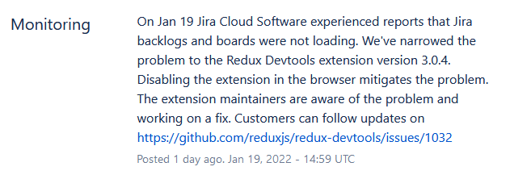

On Wednesday, January 19, 2022 at 9:25am ET, users of the Redux Devtools extension first reported that they were unable to view their backlogs and boards in Jira Cloud. The bug was [reported](https://github.com/reduxjs/redux-devtools/issues/1032) and Jira [reported the incident](https://jira-software.status.atlassian.com/incidents/5j5754ghwmsl) on their status page.



A revert patch was submitted to the Chrome Web Store at 9:49am ET, however Chrome Extensions take anywhere from a couple hours to a day to be reviewed and published. The patch was approved and published 13 hours later at 11:17pm ET.

### Background

How did an update to the Redux DevTools extension break Jira? It all came down to a change to only a few lines:

```diff
- import mapValues from 'lodash/mapValues';
- import identity from 'lodash/identity';
+ import _ from 'lodash';
```

Why was this change made? I've recently been trying to avoid ["deep imports"](https://gist.github.com/daleyjem/0f38f561a4e91e58eba580889f38330f) as a general rule since the [new exports field](https://webpack.js.org/guides/package-exports/) used by Webpack disallows any deep imports that are not explicitly defined. I thought this was the more common way to import Lodash anyway and that there wouldn't be any dangerous side effects by importing it through the main entry point. (I now know that the former way of importing Lodash is [recommended for smaller bundles](https://github.com/lodash/lodash#installation).)

Little did I know that the `main` field of `lodash` still points to a UMD build which sets `window._` to the Lodash library. I would expect most libraries these days to point to a CommonJS build and expose the UMD build in a separate field. There is an [open issue](https://github.com/lodash/lodash/issues/5107) on the Lodash repository to address this situation.

Okay, but why does having `window._` being set to the Lodash library cause problems for Jira? It's because Jira uses Underscore and [this](https://bitbucket.org/atlassian/aui/src/70cd30dc0e300768006a9124a859e2ceac66c6b7/src/js/aui/underscore.js) is how it's imported:
```js
import _ from 'underscore';

if (!window._) {
    window._ = _;
}

export default window._;
```

Since `window._` is set to the Lodash library by the Redux DevTools extension, Jira sees that `window._` is already set and exports the Lodash library thinking that it's the Underscore library.

Note that this code is found in AUI (the Atlassian User Interface library). This method for importing Underscore was [removed](https://bitbucket.org/atlassian/aui/commits/16636b709e26fdabe5846294804423a596d87466) in AUI v8.0.0 (released 11/28/2018), however it appears that some parts of Jira depend on AUI v6.0.5 (released 1/15/2017) where this non-ideal way of importing Underscore is still in production.

### Next steps

#### How does Redux DevTools prevent this from happening again?

To be clear, I take my work on the Redux DevTools very seriously. Each and every release is run through a number of automated and manual tests on each browser to prevent regressions. If I had any suspicion that the changes I made would have caused problems I would not have released the change.

I am also now vetting the page bundle that is injected into each page more carefully since this code gets run in the same context as web pages. This means that special care needs to be taken to make sure that the injected bundle does not interact in surprising ways with the rest of the web page (such as [interacting correctly with Symbol.observable polyfills](https://github.com/reduxjs/redux-devtools/pull/1003) and [not importing React](https://github.com/reduxjs/redux-devtools/pull/1031)). I now check the size of the page bundle against previous versions before publishing to alert me to any potential unintended dependencies that are being bundled.

The biggest difficulty in this situation is having to wait for the extension to be approved in the Chrome Web Store and having no way for users or the owner of the package to downgrade to an earlier version of the package. The only thing that can be done to help this situation is to use [partial rollouts](https://developer.chrome.com/docs/webstore/update/#partial-rollout) which will hopefully minimize the damage. Unfortunately the rollout percentage can only be increased, but at least I can freeze the rollout so that it has less of an impact before an updated extension can be approved.

#### How does the community fix the issues that contributed to this situation?

- Up-vote the [Lodash issue](https://github.com/lodash/lodash/issues/5107) to export ES modules. It's unfortunate that one of the most depended upon NPM packages is specifying a UMD build in their `main` entry.
- If you happen to be an Atlassian developer who has the ability to do something about this, upgrade the version of AUI being imported in Jira or figure out a way to patch the old version of AUI. I imagine that there's already efforts to move off of that old version of AUI and that it's much easier said than done, but maybe this incident will help provide a good reason for prioritizing those internal changes.
- Chrome Extensions should provide a better way to recover from a situation like this.
