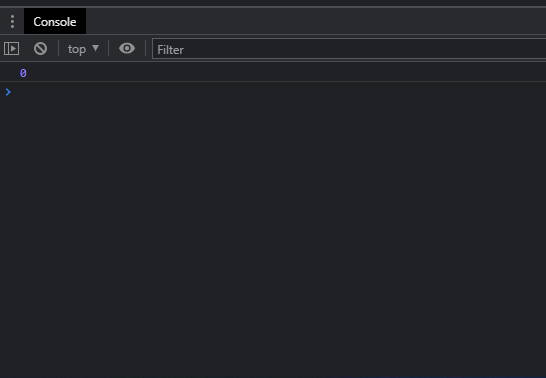
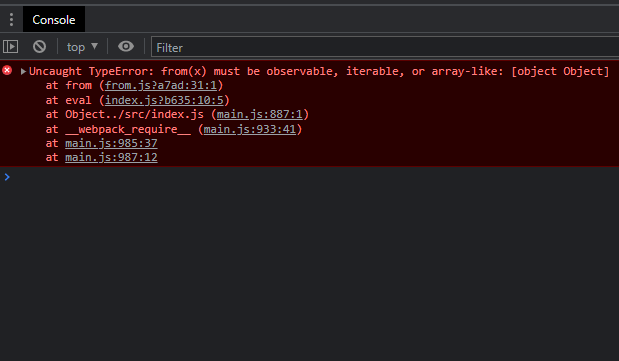

A very interesting [issue](https://github.com/reduxjs/redux-devtools/issues/1002) arose with the recent release of Redux DevTools 3.0. The basic gist of the issue was that the Redux store was not working correctly with some libraries that subscribe to the Redux store using the [observable](https://github.com/tc39/proposal-observable) symbol.

Let's look at a specific example. Let's say you're trying to observe a Redux store using Most.js like this:

```jsx
import { from } from 'most';
import { createStore } from 'redux';

const appReducer = (state = 0, action) => {
  return 0;
};

const store = createStore(appReducer);

from(store).observe(state => {
  console.log(state);
});
```

This code will log the initial state (i.e., `0`) to the console as expected.


Now let's switch the order of the imports:
```jsx
import { createStore } from 'redux';
import { from } from 'most';
```

The app will white-screen crash with an error in the console:


Why does the app crash just because we swapped the order of the imports? The reason has to do with what value Most.js and Redux are using for the observable symbol. Most.js is polyfilling `Symbol.observable` using `symbol-observable` (roughly) like this:
```jsx
export const $$observable = (() => {
  let result;

  if (typeof Symbol === 'function') {
    if (Symbol.observable) {
      result = Symbol.observable;
    } else {
      result = Symbol.for('symbol-observable');
      Symbol.observable = result;
    }
  } else {
    result = '@@observable';
  }

  return result;
})();
```

while Redux is [ponyfilling](https://github.com/sindresorhus/ponyfill) the observable symbol like this:
```jsx
export const $$observable = (() =>
  (typeof Symbol === 'function' && Symbol.observable) || '@@observable')();
```

The important thing to note is that the `symbol-observable` polyfill is writing to `Symbol.observable` while the Redux ponyfill is not. On top of that, both Redux and Most.js decide what to use for the observable symbol at the time they are imported/required. Let's take a closer look at what's going on when you import these packages.

If you import them like this:
```jsx
// `most` imports `symbol-observable` which polyfills `Symbol.observable`
import { from } from 'most'; 
// `redux` uses `Symbol.observable` since it has been polyfilled
import { createStore } from 'redux';
```
everything is fine because `Symbol.observable` is polyfilled before Redux tries to access it and so Most.js and Redux are using the same value for `Symbol.observable`.

But if you import them like this:
```jsx
// `redux` uses `'@@observable'` since `Symbol.observable` hasn't been polyfilled
import { createStore } from 'redux';
// `most` polyfills `Symbol.observable`
import { from } from 'most';
```

The Redux store will be created with an `'@@observable'` property instead of a `Symbol.observable` property because Redux is imported before Most.js has had the chance to polyfill `Symbol.observable`. This causes a white-screen because Most.js is expecting an object with a `Symbol.observable` property, not an `'@@observable'` property.

So what's the solution?

**No library should depend on `symbol-observable`**. Instead all libraries should use the standardized ponyfill that [Redux](https://github.com/reduxjs/redux/blob/master/src/utils/symbol-observable.ts) or [RxJS](https://github.com/ReactiveX/rxjs/blob/master/src/internal/symbol/observable.ts) currently use and let the user decide whether to polyfill `Symbol.observable` themselves before they import any other libraries.
